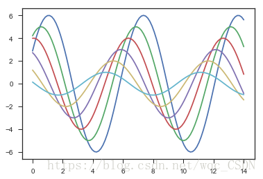
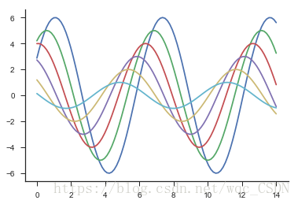

# 模块函数介绍

## 一、numpy模块

​	numpy(Numeric Python)模块是Python的一种开源的数值计算扩展。这种工具可用来存储和处理大型矩阵，比Python自身的嵌套列表(nested list structure)结构要高效的多（该结构也可以用来表示矩阵(matrix)）。据说numpy将Python相当于变成一种免费的更强大的Matlab系统。

​	numpy朋友模块提供了许多高级的数值编程工具，如：矩阵数据类型、矢量处理、以及精密的运算库等。

1. 一个强大的N维数组对象Array；
2. 比较成熟的（广播）函数库；
3. 用于整合C/C++和Fortran代码的工具包；
4. 实用的线性代数、傅里叶变换、和随机数生成函数。

### numpy.ones()

ones函数可以创建任意维度和元素个数的数组，其元素值均为1；

e.g. 

```python
ones = pd.DataFrame({'ones':np.ones(len(df))}) #ones是m行1列的dataframe
```

### numpy.astype()

转换数据类型。

e.g.

```python
(prob >=0.5).astype(int)
```

### numpy.linspace()

```python
numpy.linspace(start , stop , num=50 , endpoint=True , retstep=False , dtype=None)
```

在指定的间隔内返回均匀间隔的数字。

返回num均匀分布的样本，在[start , stop]。 类似于arange,arange使用的是步长，而不是样本的数量

**Parameters(参数):**	

* start : scalar(标量)

The starting value of the sequence(序列的起始点).

* stop : scalar

序列的结束点，除非endpoint被设置为False，在这种情况下, the sequence consists of all but the last of num + 1 evenly spaced samples(该序列包括所有除了最后的num+1上均匀分布的样本(感觉这样翻译有点坑)), 以致于stop被排除.当endpoint is False的时候注意步长的大小(下面有例子).

* num : int, optional(可选)

生成的样本数，默认是50。必须是非负。

* endpoint : bool, optional

如果是真，则一定包括stop，如果为False，一定不会有stop

* retstep : bool, optional

If True, return (samples, step), where step is the spacing between samples.(看例子)

* dtype : dtype, optional

The type of the output array. If dtype is not given, infer the data type from the other input arguments(推断这个输入用例从其他的输入中).

**Returns**:	

* samples : ndarray

There are num equally spaced samples in the closed interval [start, stop] or the half-open interval [start, stop) (depending on whether endpoint is True or False).

* step : float(只有当retstep设置为真的时候才会存在)

Only returned if retstep is True

Size of spacing between samples.
e.g.

```python
>>> np.linspace(2.0 , 3.0 , num=5)
array([2. , 2.25 , 2.5 , 2.75 , 3.])
```


## 二、pandas模块

​	Pandas（Python Data Analysis Library）是基于numpy的一种工具，该工具是为了解决数据分析任务而创建的。Pandas纳入了大量库和一些标准的数据模型，提供了高效的操作大型数据集所需的工具。pandas提供了大量能使我们快速便捷的处理数据的函数和方法。

​	Pandas中的数据结构有如下几种：

1. Series：一维数组，与numpy中的array类似。二者与Python基本的数据结构List也很相近，其区别是：List中的元素可以是不同的数据类型，而Array和Series中则只允许存储相同的数据类型，这样可以更有效地使用内存，提高运算效率。
2. Time-Series：以时间为索引的Series。
3. DataFrame：二维的表格型数据结构。很多功能与R中的data.frame类似。可以将DataFrame理解为Series的容器。
4. Panel:三维的数组，可以理解为DataFrame的容器。

### pandas.concat()

cancat函数是在pandas底下的方法，可以将数据根据不同的轴作简单的融合。

```python
pd.concat(objs , axis=0 , join='outer' , join_axes=None , ignore_index=False ,\\
         keys=None , levels=None , names=None , verify_integrity=False)
```

参数说明：

objs : series , dataframe 或者 panel 构成的序列 list；

axis : 需要合并链接的轴，0是行，1是列；

join : 连接的方式inner,或者outer;

e.g.

```python
    data = pd.concat([ones , df] , axis=1)#合并数据，根据列合并
```

### pandas.read_csv()

读取CSV（逗号分割）文件到DataFrame,也支持文件的部分导入和选择迭代

e.g.

```python
df = pd.read_csv("ex1data1.txt" , names=['population' , 'profit'])
```

**参数**

**filepath_or_buffer**:可以是URL，可用URL类型包括：http,ftp,s3和文件。

**sep**:指定分隔符。如果不指定参数，则会尝试使用逗号分隔。分隔符长于一个字符并且不是'\s+',将使用python的语法分析器。并且忽略数据中的逗号。

**names**:用于结果的列名列表，如果数据文件中没有列标题行，就需要执行header=None。默认列表中不能出现重复，除非设定参数mangle_dupe_cols=True。

## 

## 三、seaborn模块

​	Matplotlib是Python主要的会图库。但是，不建议直接使用它。虽然Matplotlib很强大，但它因此也很负责，你的图经过大量的调整才能变得精致。因此，作为替代，推荐一开始使用seaborn。seaborn本质上使用Matplotlib作为核心库（就像Pandas对Numpy一样）。seaborn有以下几个有点：

1. 默认情况下，就能创建赏心悦目的图表。
2. 创建具有统计意义的图。
3. 能理解pandas的DataFrame类型，所以他们一起可以很好地工作。

### seaborn.set()

```python
seaborn.set(context='notebook' , style='darkgrid' , palette='deep' , font='sans-serif',
           font _scale=1 , color_codes=True , rc=None)
```

set_style():5种主题风格

```python
sns.set_style("whitegrid")
```


1. darkgrid 黑色网格
2. whitegrid 白色网格
3. dark 黑色背景
4. white 白色背景
5. ticks 加上刻度的白色背景

使用sns.despine()函数来去除图片顶部和右侧的坐标轴线，使得图片更加美观。

```python
#使用Seaborn提供的主题绘制
sns.set_style("ticks")
sinplot()
```



```python
sns.set_style('ticks')
sinplot()
sns.despine()
```



context风格：paper , notebook , talk , poster

### seaborn.lmplot()

e.g.

```python
sns.lmplot('population', 'profit', df, height=6, fit_reg=False)
```

fit_reg:回归线

### seaborn.relplot()

e.g.

```python
data_show = pd.DataFrame(dict(epoch=np.arange(epoch+1) , cost=cost_data))
sns.relplot(x='epoch' , y='cost' , kind='line' , data=data_show)
```

若是其中kind='scatter'，则可以画出散点图。

## 四、tensorflow模块

### tf.get_variable()

```python
tf.get_variable(name , shape , initializer)
```

e.g.

```python
W = tf.get_variable("weights" , (X_data.shape[1] , 1) , initializer=tf.constant_initializer())#n*1
```

name就是变量的名称，shape是变量的维度，initializer是变量初始化的方式，初始化方式有以下几种：

- tf.constant_initializer():常量初始化函数
- tf.random_normal_initializer():正态分布
- tf.truncated_normal_initializer():截取的正态分布
- tf.random_uniform_initializer():均匀分布
- tf.zeros_initializer():全部是0
- tf.ones_initializer():全部是1
- tf.uniform_unit_scaling_initialzer():满足均匀分布，但不影响输出数量级的随机值

### tf.reset_default_graph()

这个方法能够重置整个graph

### input_data

导入：

```python
from tensorflow.examples.tutorials.mnist import input_data
```

e.g.

```python
mnist = input_data.read_data_sets('MNIST_data' , one_hot=True)
```

把mnist数据集读取内存，

one_hot=True表示用非零即1的数组保存图片表示的数值。比如图片上写的是0，内存中不是直接存一个0，而是存一个数组[1,0,0,0,0,0,0,0,0,0].

### tf.cast()

改变某个张量的数据类型

e.g.

```python
accuracy = tf.reduce_mean(tf.cast(correct_prediction , tf.float32))
```

### tf.truncated_normal()

```python
tf.truncated_normal(shape , mean , stddev)
```

stddev是标准差，神经网络中取随机数

e.g.

```python
initial = tf.truncated_normal(shape , stddev=0.1)
```

### tf.constant()

e.g.

```python
initial = tf.constant(0.1 , shape=shape)
```

常数，初始值是0.1

### tf.nn.conv2d()

卷积层函数

e.g.

```python
# 卷积层函数
def conv2d(x , W):
    #stride[1 , x_movement , y_movement ,1]定义步长
    return tf.nn.conv2d(x , W , strides=[1,1,1,1] , padding='SAME')
```

stride[1 , x_movement , y_movement ,1]	定义步长

### tf.nn.max_pool()

e.g.

```python
# 池化函数
def max_pool_2x2(x):
    return tf.nn.max_pool(x , ksize[1 , 2 , 2 , 1] , strides=[1 , 2 , 2 , 1] , padding='SAME')
```


## 五、scipy.optimize模块

### scipy.optimize.minimize()

```python
scipy.optimize.minimize(fun , x0 , args=() , method=None , jac=None , hessp=None , bounds=None , Constraints=() , tol=None , callback=None , options=None)
```

fun:求最小值的目标函数

x0:变量的初始猜测值，如果有多个变量，需要个每个变量一个初始猜测值。minimize是局部最优的解法

args:常数值，fun中没有数字，都以变量的形式表示，对于常数项，需要在这里给值

method：求极值的方法。

Type of solver. Should be one of

> - ‘Nelder-Mead’ [(see here)](https://docs.scipy.org/doc/scipy/reference/optimize.minimize-neldermead.html#optimize-minimize-neldermead)
> - ‘Powell’ [(see here)](https://docs.scipy.org/doc/scipy/reference/optimize.minimize-powell.html#optimize-minimize-powell)
> - ‘CG’ [(see here)](https://docs.scipy.org/doc/scipy/reference/optimize.minimize-cg.html#optimize-minimize-cg)
> - ‘BFGS’ [(see here)](https://docs.scipy.org/doc/scipy/reference/optimize.minimize-bfgs.html#optimize-minimize-bfgs)
> - ‘Newton-CG’ [(see here)](https://docs.scipy.org/doc/scipy/reference/optimize.minimize-newtoncg.html#optimize-minimize-newtoncg)
> - ‘L-BFGS-B’ [(see here)](https://docs.scipy.org/doc/scipy/reference/optimize.minimize-lbfgsb.html#optimize-minimize-lbfgsb)
> - ‘TNC’ [(see here)](https://docs.scipy.org/doc/scipy/reference/optimize.minimize-tnc.html#optimize-minimize-tnc)
> - ‘COBYLA’ [(see here)](https://docs.scipy.org/doc/scipy/reference/optimize.minimize-cobyla.html#optimize-minimize-cobyla)
> - ‘SLSQP’ [(see here)](https://docs.scipy.org/doc/scipy/reference/optimize.minimize-slsqp.html#optimize-minimize-slsqp)
> - ‘trust-constr’[(see here)](https://docs.scipy.org/doc/scipy/reference/optimize.minimize-trustconstr.html#optimize-minimize-trustconstr)
> - ‘dogleg’ [(see here)](https://docs.scipy.org/doc/scipy/reference/optimize.minimize-dogleg.html#optimize-minimize-dogleg)
> - ‘trust-ncg’ [(see here)](https://docs.scipy.org/doc/scipy/reference/optimize.minimize-trustncg.html#optimize-minimize-trustncg)
> - ‘trust-exact’ [(see here)](https://docs.scipy.org/doc/scipy/reference/optimize.minimize-trustexact.html#optimize-minimize-trustexact)
> - ‘trust-krylov’ [(see here)](https://docs.scipy.org/doc/scipy/reference/optimize.minimize-trustkrylov.html#optimize-minimize-trustkrylov)
> - custom - a callable object (added in version 0.14.0), see below for description.

jac:梯度矢量的计算方法。仅适用于CG,BFGS,Newton-CG,L-BFGS-B,TNC,SLSQP,dogleg,trust-ncg,trust-krylov,trust-exact和trust-constr。如果他是一个可调用的，则应该是一个返回梯度向量的函数。

constraints：约束条件，针对fun中为参数的部分进行约束限制。

## 六、sklearn.metrics.classification_report()

这个包是评价报告。

导入：

```python
from sklearn.metrics import classification_report()
```

e.g.

```python
print(classification_report(y, y_pred))
```

```python
              precision    recall  f1-score   support

           0       0.87      0.85      0.86        40
           1       0.90      0.92      0.91        60

    accuracy                           0.89       100
   macro avg       0.89      0.88      0.88       100
weighted avg       0.89      0.89      0.89       100
```

